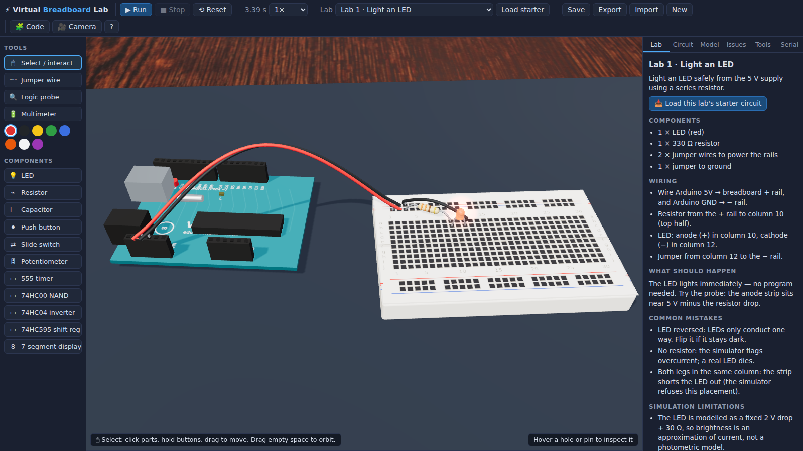

# ⚡ Virtual Breadboard Lab

A realistic 3D Arduino-style breadboard simulator and educational electronics
workbench, built with **Vite + vanilla TypeScript + Three.js + Blockly**.

Place components on a half-size breadboard, run curved jumper wires, write
Scratch-like block programs for an Arduino-style board, run a digital-first
educational simulation, probe signals, and follow four guided labs — while a
live linter flags the classic beginner mistakes (missing resistors, floating
inputs, shorts, unpowered chips…).



## Run it

```bash
npm install
npm run dev       # development server (http://localhost:5173)
npm run build     # type-check + production build into dist/
npm run preview   # serve the production build
npm run verify    # build first! headless browser checks + screenshots
node scripts/pointer-test.mjs   # extra mouse-interaction smoke test
```

The verification scripts use Playwright. They pick up a pre-provisioned
Chromium at `/opt/pw-browsers/chromium` if one exists; on a fresh machine run
`npx playwright install chromium` once first.

## Features

- **3D maker workbench** — wooden desk (CC0 Poly Haven texture), anti-static
  mat, half-size breadboard (30 columns + 4 rails), Uno-style MCU board with
  labelled headers, orbit/pan/zoom camera with reset.
- **Components** — LEDs (5 colours), resistors (with computed colour bands),
  electrolytic capacitor, push button (hold to press), slide switch,
  potentiometer, 555 timer, 74HC00 NAND, 74HC04 inverter, 74HC595 shift
  register, common-cathode 7-segment display.
- **Breadboard-accurate connectivity** — rows a–e / f–j joined per column,
  full-length power rails, one leg or wire end per hole, DIP chips straddle
  the ravine. Hover any hole/pin for its identity and live voltage.
- **Wiring** — pick a colour, click two points; wires render as curved jumpers.
  Select + `Delete` removes parts/wires; drag parts to move them.
- **Block coding (Google Blockly, Zelos renderer)** — hat/forever/repeat/wait,
  digital read/write/toggle, analog read, PWM write, `map`, variables,
  logic/math, `shift out byte`, `display digit on 7-segment`, `pulse pin`,
  `print to serial monitor`, `highlight pin`, probe label. Four bundled
  samples: Blink, Button→LED, Potentiometer fade, 7-segment counter.
  Blocks compile into a small internal AST executed by a cooperative
  interpreter (no JS eval, no Arduino compiler).
- **Guided labs + free build** — (1) LED + resistor, (2) button → digital
  input → LED, (3) 555 astable blinker, (4) 74HC595 driving a 7-segment
  counter. Each lab has goal, parts, wiring steps, expected behaviour,
  circuit explanation, common mistakes, limitations, and a one-click
  **Load starter** button that places a known-good circuit + program.
- **Instruments** — logic probe (HIGH/LOW/floating/conflict + volts),
  simplified multimeter (voltage between two points), serial monitor with
  sim-time stamps.
- **Validation** — live Issues panel: 5V↔GND shorts, LED missing resistor /
  reversed / overcurrent, pin overcurrent, missing common ground, unpowered
  ICs, floating CMOS inputs, 555 wiring hints, 595 MR/OE mistakes, unpowered
  rails in use, wires to empty strips, unwired program pins, parts not in any
  circuit.
- **Persistence** — auto-save + Save button (localStorage), Export/Import
  project JSON (components, wires, lab, block program, settings). Lab starters
  double as built-in example projects.
- **Keyboard** — `Esc` cancel/clear, `Delete` remove selection, `R` run/stop,
  `0` reset camera.

## Simulation model (and honest limitations)

**This is a digital-first educational model, not SPICE.** The in-app
*Model* panel documents the same thing.

How it works: permanently-joined points (strips, rails, header pins) share a
net key; wires, pressed buttons and switch positions merge keys into **nets**
(union-find). Supplies and output pins fix their net's voltage ("strong
drivers"). Every other net takes the conductance-weighted average of its
neighbours through elements (relaxation): resistors are ideal, an LED is a
2 V drop + 30 Ω when forward-biased (brightness ∝ current, clamped ≈12 mA),
a potentiometer is two resistors, and a capacitor uses the standard
backward-Euler companion model (a C/Δt conductance behind its stored
voltage — unconditionally stable for any R·C, correct for parallel caps).
Time advances in 1 ms steps; block programs run
as cooperative threads inside those steps; 74HC595 clocks are edge-triggered
per step; the 555 is a behavioural model (⅓/⅔ VCC comparators + latch +
discharge switch).

**Not modelled:** transistor-level analog behaviour, AC/inductance/noise,
real output impedance and drive limits (only a rough overcurrent warning),
switch bounce, ns-scale propagation delays, 555 CTRL modulation, exact CMOS
thresholds (fixed 2.5 V), and component damage (you get warnings instead of
smoke). PWM is modelled as an average voltage, so a PWM'd LED dims smoothly
but a scope-style waveform is not available. Digital reads of floating nets
return deterministic pseudo-noise to teach why floating inputs are bad.
Shift-register clocking is deliberately slowed (~1 ms per edge) so you can
watch it work; a real 595 clocks at MHz.

## Key files

```
index.html, vite.config.ts, tsconfig.json
src/
  main.ts                     app composition root, run loop, toolbar, test hook
  types.ts                    shared types (snap points, components, project)
  persistence.ts              localStorage + import/export JSON
  core/
    boards.ts                 breadboard + Arduino layout & snap-point registry
    circuit.ts                placed parts/wires, occupancy, serialization
    simulation.ts             net solver, IC models, capacitor integration
    validation.ts             static circuit lint (issues panel)
    program/ast.ts            constrained behaviour model (AST)
    program/compiler.ts       Blockly workspace → AST
    program/interpreter.ts    cooperative multi-thread interpreter
  data/
    componentDefs.ts          component catalog (pins, footprints, docs)
    labs.ts                   4 guided labs + free build, starter circuits
    samplePrograms.ts         Blockly JSON for the 4 sample programs
  three/
    scene.ts                  renderer, camera, lights, desk, mat
    boardsMesh.ts             breadboard + Arduino meshes (canvas textures)
    componentMeshes.ts        procedural component meshes + live visuals
    wiresMesh.ts              curved jumper-wire tubes
    view.ts                   scene orchestration, picking, ghosts, markers
  ui/
    layout.ts                 DOM shell (toolbar, palette, panels, drawer)
    panels.ts                 lab guide / explanation / model / issues / tools / serial
    interaction.ts            pointer state machine (place, wire, drag, probe)
    blocklyBlocks.ts          custom blocks, toolbox, theme, injection
scripts/verify.mjs            headless verification harness (npm run verify)
scripts/pointer-test.mjs      real mouse-event interaction smoke test
scripts/sim-regress.mjs       solver regression checks (RC curves, IC chains)
verification/                 screenshots captured by npm run verify
ASSETS.md                     asset inventory & licenses
```

## Verification performed

`npm run verify` (Playwright + headless Chromium against the production
build) ran clean — **10/10 checks**:

1. Lab 1 auto-loads on first visit; the LED lights from the rails with **no
   program** (brightness ≈ 0.69 of max ⇒ ~9 mA through 330 Ω — correct).
2. WebGL canvas renders non-blank content.
3. **Blink sample** drives D13 and the sampled states alternate at the
   expected ~500 ms cadence (observed `110011001100` at 280 ms sampling).
4. **Lab 2**: pressing the button turns the LED on via the block program and
   releasing turns it off (0.00 → 0.69 → 0.00).
5. **Lab 3**: the 555 astable blinks the LED with no program running.
6. **Lab 4**: the 74HC595 lights a multi-segment digit pattern on the
   7-segment display (segment-count assertion, not glyph-exactness).
7. Serial monitor receives the counter's prints (`0,1,2,3…`).
8. Blockly editor renders and is usable.
9. An LED jammed straight across 5 V/GND produces `led-no-resistor` +
   `led-overcurrent` issues.
10. No page/console errors.

`node scripts/pointer-test.mjs` additionally drives the app with real mouse
events — 6/6: click-click wiring, two-click LED placement, one-click button
footprint placement, click-select + `Delete`, `Esc` cancelling a wire in
progress, and hover identity in the status bar.

`node scripts/sim-regress.mjs` checks solver physics — 5/5: two parallel
capacitors follow the real RC curve (τ = R·C_total, never exceeding the
supply), a capacitor whose strips get bridged by a wire stays finite, and a
six-inverter 74HC04 chain settles to the correct logic levels (IC outputs
feeding IC inputs).

The app was also reviewed by a multi-agent adversarial pass (simulation,
circuit data, program system, UI, docs); confirmed findings — including a
capacitor-integration flaw, IC-to-IC clocking, real tact-switch pin
orientation, and GPU resource leaks — were fixed and re-verified.

Screenshots saved under `verification/`:
`01-workbench.png` (initial view), `02-lab4-running.png` (guided lab running,
probe attached), `03-block-editor.png` (Blockly drawer),
`04-validation-issues.png` (Issues panel), `05-narrow-viewport.png`
(responsive layout, collapsible side panel).

## Known limitations

- Electrical realism limits above; the solver is relaxation-based and meant
  for beginner-scale circuits (tens of parts), not large designs.
- Two-pin parts whose leg sits on a rail or Arduino pin can't be drag-moved
  (delete + re-place); footprint parts keep their orientation (no rotation).
- One breadboard and one MCU board; no daisy-chained 595s in the helper block
  (wire QH′ manually and shift twice instead).
- PWM/serial timing is idealized (no baud rates); PWM blocks only offer the
  real Uno's PWM-capable pins (3, 5, 6, 9, 10, 11).
- Procedural 3D models are stylized approximations (see ASSETS.md).
- Sounds are not used; Blockly media ships locally for offline use.
